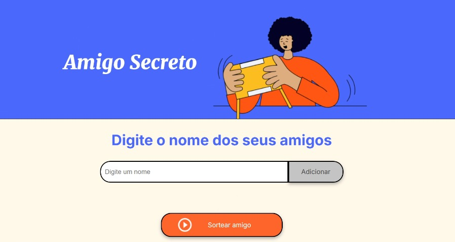

<h1 align="center">Sorteio Fácil</h1>

<h3>Uma aplicação simples para sortear uma pessoa aleatoriamente.</h3>

    <h4>Funcionalidades</h4>
    <ul>
        <li>Adicionar pessoas a uma lista</li>
        <li>Impede a adição de nomes vazios</li>
        <li>Sorteia uma pessoa aleatoriamente</li>
        <li>Bloqueia o sorteio se a lista estiver vazia</li>
    </ul>

<h4>Demonstração</h4>

     
     
    

    <h4>Tecnologias utilizadas</h4>
    <ul>
        <li>HTML - Estrutura do projeto - <a href="https://developer.mozilla.org/pt-BR/docs/Web/HTML">Documentação HTML</a></li>
        <li>JAVASCRIPT - Lógica do sorteio - <a href="https://developer.mozilla.org/pt-BR/docs/Web/JavaScript">Documentação JS</a></li>
        <li>CSS - Estilização e layout - <a href="https://developer.mozilla.org/pt-BR/docs/Web/CSS">Documentação CSS</a></li>        
    </ul> 

